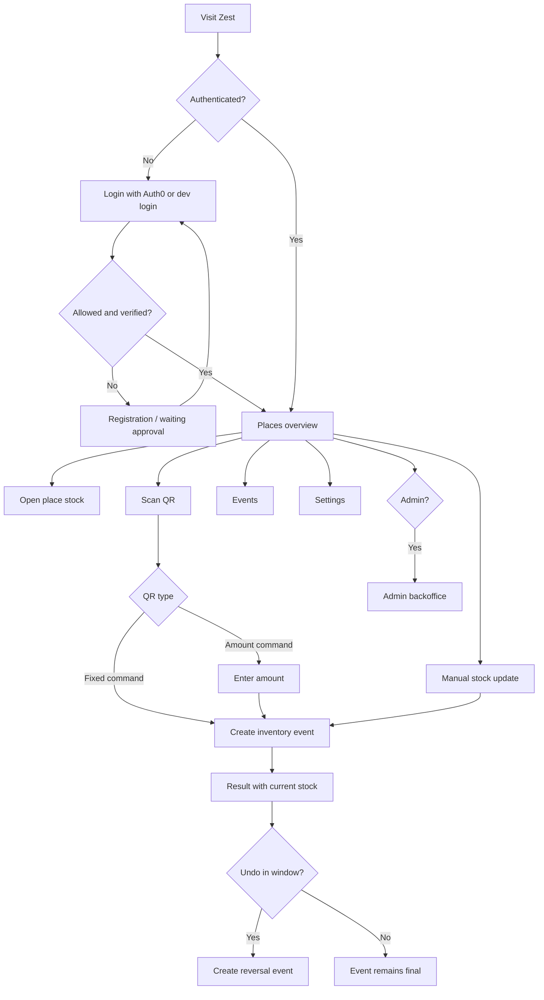
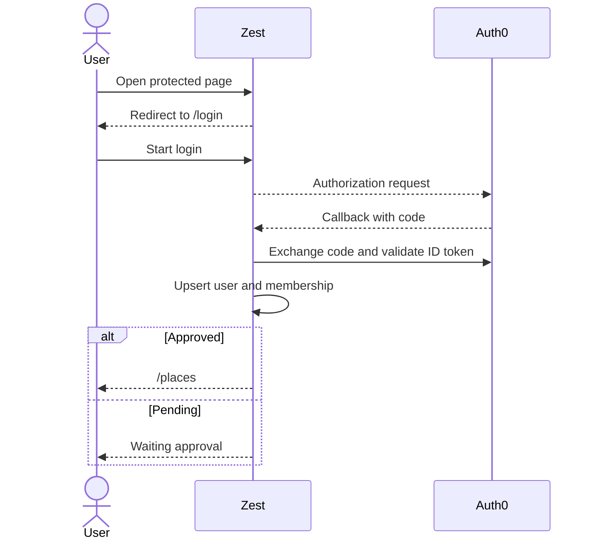
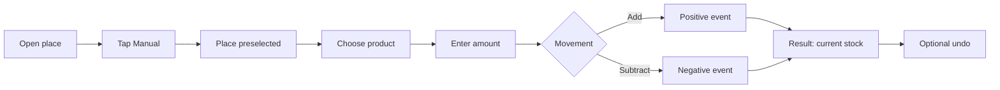
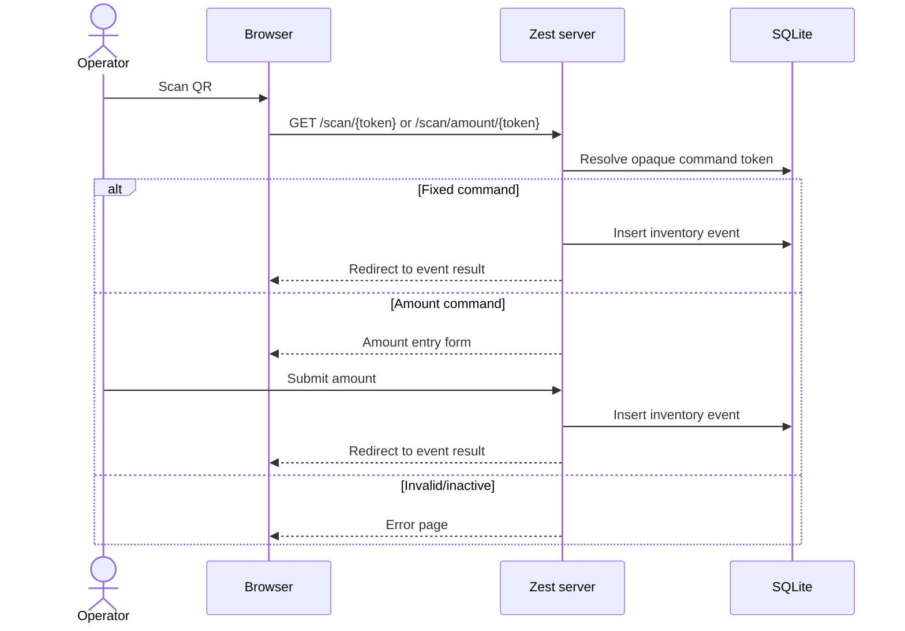
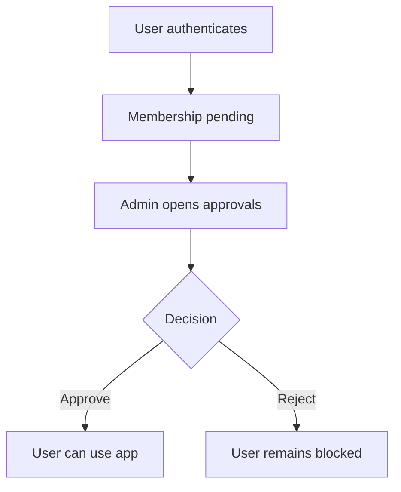
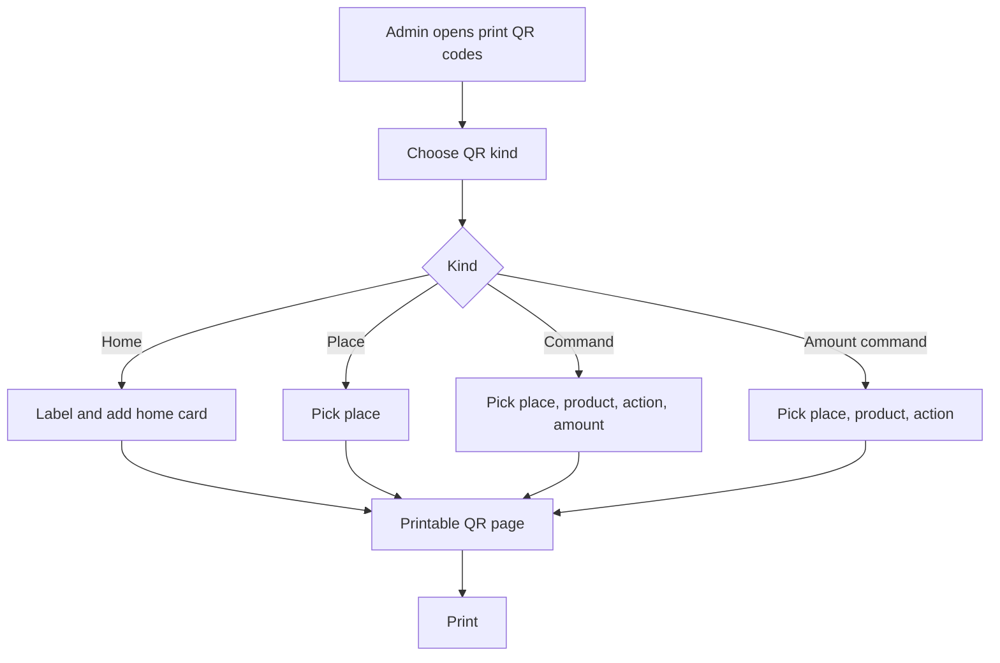

# Zest User Flows

This document describes the main user journeys in Zest, a server-rendered QR inventory movement application. Zest keeps inventory append-only: every stock change is an `inventory_events` record, and undo writes a reversal event instead of editing history.

## Actors

- **Operator**: scans QR codes, views places and stock, records inventory movements, and reviews recent events.
- **Admin**: manages memberships, places, products, printable QR cards, event history, and reports.
- **Pending user**: has authenticated but is waiting for admin approval.

## Flow map

## Authentication and access

1. The user opens Zest and is redirected to `/login` when no valid session exists.
2. Production login uses Auth0 Authorization Code Flow through `/auth/login` and `/auth/callback`.
3. Development can expose `/dev/login` for seeded operator/admin access.
4. After login, Zest creates its own HttpOnly session cookie.
5. Users who are not approved see a waiting approval state until an admin approves their membership.
6. Approved operators land on the places overview. Approved admins can also enter the admin area.

## Operator home: places and stock

1. The operator opens `/places`.
2. Each place card summarizes current stock by product.
3. Selecting a place opens `/places/{place_token}` with product cards and current quantities.
4. Negative stock is highlighted as a warning; zero stock is shown as an empty state.
5. From a place page, the operator can start a manual stock movement preselected to that place.

## Quick update of product stock in a place

Use this flow when an operator needs to update inventory quickly without hunting through admin screens.

### Option A: Place page manual update

1. Open **Places**.
2. Select the place where stock changed.
3. Tap **Manual** on the place page.
4. Confirm the place is preselected.
5. Choose the product.
6. Enter the amount or tap a common amount chip.
7. Tap **Add** to increase stock or **Subtract** to decrease stock.
8. Review the result page and current stock.
9. If the update was wrong, tap **Undo** before the countdown expires.

### Option B: Amount QR update

1. Scan a printed amount QR for the target place/product/action.
2. Enter the amount on the amount scan page.
3. Submit the add/subtract action.
4. Review current stock on the result page.
5. Undo within the configured undo window if needed.

## QR scan inventory movement

Zest supports two inventory QR patterns:

- **Fixed command QR**: encodes place, product, action, and amount. Scanning immediately records the movement.
- **Amount command QR**: encodes place, product, and action. The operator enters the amount before submission.

Flow:

1. Operator taps **Scan** from the bottom action bar or opens `/scan`.
2. Browser camera scans a QR URL from the same Zest origin.
3. The app validates the opaque command token server-side.
4. Inactive commands, places, or products are rejected.
5. A valid fixed command creates an inventory event and redirects to the result page.
6. A valid amount command opens an amount entry form, then creates the event.

## Manual inventory movement

1. Operator opens `/manual` or taps **Manual** from a place page.
2. Operator selects place and product.
3. Operator enters a positive amount or selects a common amount chip.
4. Operator chooses **Add** or **Subtract**.
5. Server creates one inventory event with a positive or negative quantity.
6. The result page shows the recorded movement and derived current stock.

## Result and undo

1. After any stock movement, the result page shows:
   - movement direction,
   - amount,
   - product,
   - place,
   - current derived stock,
   - creation time.
2. If stock is negative, the page shows a warning.
3. The undo panel counts down for the configured undo window.
4. Pressing undo posts to `/events/{id}/undo`.
5. The server validates the undo window and creates a reversal event with the opposite quantity.
6. Double undo is blocked.

## Events and reports

- `/events` shows recent event cards for operators.
- `/admin/events` shows event history in the admin area.
- `/admin/reports` shows report filters, preview rows, and a CSV export action.
- `/admin/reports/export.csv` exports event rows for external analysis.

## Admin membership approvals

1. Admin opens `/admin/memberships`.
2. Pending users are listed with name, email, and status.
3. Admin approves or rejects each membership.
4. Approved users can access operator flows after their next authenticated request.

## Admin place management

1. Admin opens `/admin/places`.
2. Admin can create a place with a name.
3. Existing places can be renamed.
4. Places can be archived or restored.
5. Archiving a place with stock asks for confirmation.
6. Place QR matrices can be printed from the place-specific QR matrix route.

## Admin product management

1. Admin opens `/admin/products`.
2. Admin can create products with name, code, unit, and display color.
3. Existing products can be edited.
4. Products can be archived or restored.
5. Product color is used for visual identity, but labels remain text-based so color is not the only indicator.

## Admin QR and print flows

Admins can generate and print QR cards from `/admin/print-qr-codes`:

- **Home QR**: opens the places overview.
- **Place QR**: opens a specific place page.
- **Command QR**: records a fixed add/subtract amount for a place/product.
- **Amount command QR**: lets the operator enter the amount for a place/product/action.

## Settings and localization

1. User opens `/settings`.
2. User chooses device language, English, or German.
3. User chooses a time display format.
4. Settings are stored on the user record and applied to later requests.

## Development QR flow

In development, `/dev/qr-codes` lists active QR commands as clickable cards. This supports testing scan flows without using a camera or printed QR codes. Production should rely on printed/generated QR cards instead.
